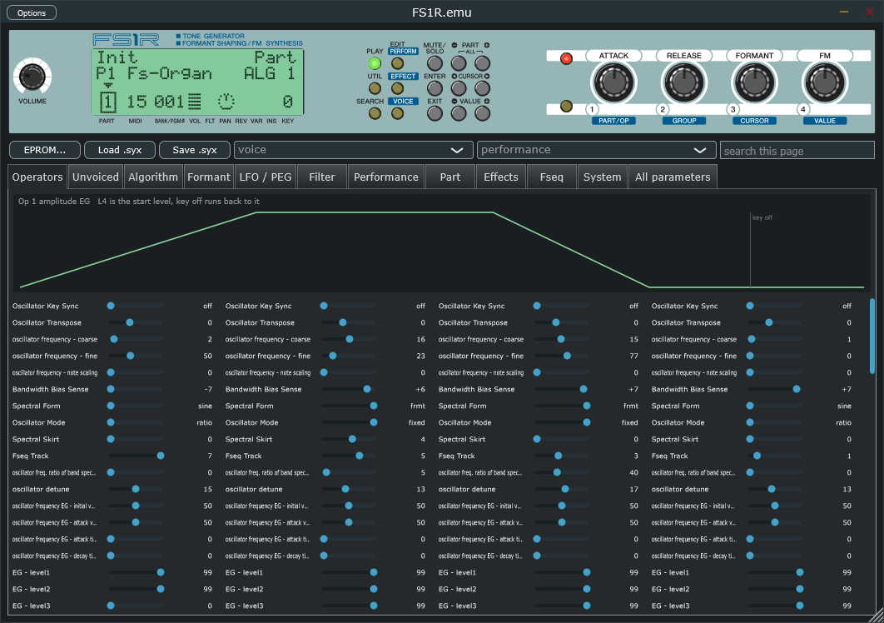

# FS1R.emu



The Yamaha FS1R as a plugin and a console synth: its firmware logic rewritten in C++ from the decompiled ROM, four parts, 32 channels, the filter, both LFOs, pan, the three effect blocks, performances and Fseq playback. VST3, CLAP and standalone, with the front panel as the GUI.

Download the latest build: **https://github.com/musicastudio/FS1R.emu/releases/latest** (no installer, no dependencies).

Licensed GPL-3, see `LICENSE` and `NOTICE.md`.

**Discord:** https://discord.gg/6sXu3GmkNm

This project is still in development, still not fully accurate to hardware.

**FS1R demo song "Vokodrone" from real hardware (courtesy of rgwan)**

https://github.com/user-attachments/assets/1261aa38-1618-4524-8296-f5b9f0c4131b

[Download](https://raw.githubusercontent.com/musicastudio/FS1R.emu/main/captures/fs1r_demo01_hardware.mp4) if the player does not load.

**FS1R demo song "Vokodrone" on FS1R.emu v0.3.2**

https://github.com/user-attachments/assets/344fa64c-4c79-4513-9388-a0d28e15c197

[Download](https://raw.githubusercontent.com/musicastudio/FS1R.emu/main/captures/fs1r_demo01_engine.mp4) if the player does not load.

**FS1R demo song "Full Tines" from real hardware (courtesy of rgwan)**

<!-- Inline players need a github.com/user-attachments/assets URL, which only the web editor mints:
     drag captures/fs1r_demo02_hardware.mp4 into a comment box on GitHub and paste the URL it gives
     back on the line below, the way the two Vokodrone clips above were done. -->

[Download](https://raw.githubusercontent.com/musicastudio/FS1R.emu/main/captures/fs1r_demo02_hardware.mp4) if the player does not load.

**FS1R demo song "Full Tines" on FS1R.emu v0.3.2**

<!-- Same again for captures/fs1r_demo02_engine.mp4. -->

[Download](https://raw.githubusercontent.com/musicastudio/FS1R.emu/main/captures/fs1r_demo02_engine.mp4) if the player does not load.

Both Full Tines clips carry the same +10 dB, so the level between them is the unit's against ours: the engine is about 10 dB quieter on the demo, and its ending stops about four seconds before the hardware's does. Neither is fixed yet; the working is in `TODO.md` under Tier 4.

## Thanks

This project would not exist without **[rgwan/fs1r_firmware_RE](https://github.com/rgwan/fs1r_firmware_RE)** and its author, Zhiyuan Wan. That project dumped the SH7044's 256 KB internal flash through a hooked UART, dumped the 2 MB external EPROM, dumped the PLG150-DX ROM, captured the board's UART traffic, and published a Ghidra project with the boot, loader, flash and LCD code already named. Every byte of firmware and every preset this emulator reads comes from those dumps. This project is a synth engine that runs the firmware's logic directly, but it stands entirely on that groundwork. That work is written up in the [yamahamusicians.com thread](https://yamahamusicians.com/forum/threads/im-trying-to-emulating-an-fs1r.23211/).

FS1R representation in the GUI was created using vectors from the [official FS1R user manual](https://usa.yamaha.com/support/manuals/index.html?l=en&c=music_production&k=fs1r).

## Background

The FS1R (1998) is Yamaha's formant-shaping FM synth: 8 operators per voice, 32 channels, four parts, and a second oscillator type that generates a formant with a shaped spectral window instead of a sine. Its tone generator is the YMP706, a QFP128 part used in exactly two products, the FS1R and the PLG150-DX board. There is no public register documentation for it and no emulation of it anywhere.

So the engine here is reconstructed from the firmware rather than from the chip. `tools/build_fs1r_ghidra.py` imports the EPROM into Ghidra as SH-2 and decompiles it; the note-on path, the tick pipeline, the parameter conversion tables and the 88-algorithm routing table are read straight out of that code and ported to C++. Where the firmware only writes a register value and the chip's response is unknown, the behaviour is inferred from the DX7 lineage and from Yamaha's formant synthesis patent (US5610354), and those places are marked INFERRED in the source.

To be clear about what this is: a rewrite of the FS1R's logic, not an emulation of the processors on the board. The SH7044 is not emulated and its firmware does not run here; the note-on path, tick pipeline and conversion tables were read out of the decompiled code and rewritten in C++. The YMP706 tone generator is a model built from those register values, since no one has its register semantics. Running the real firmware on an SH-2 core (gearmulator has one with the SH7040 peripherals) is on the roadmap as a way to verify the rewrite, not to replace it. The effects run on a YSS236-F DSP (Yamaha's VOP3, also the synthesis engine of the AN1x) whose program the CPU uploads from the EPROM at boot; nobody has decoded that instruction set, so the effects are modelled from the Data List too. There are two of those chips, one effect processor and one per-voice filter, each with its own window on the CPU bus, and the filter is modelled for the same reason. `TODO.md` opens with the full KNOWN / INFERRED / UNKNOWN lists.

The practical result: patches, performances and Fseqs load and play with the same parameter interpretation the hardware uses, because the same logic computes them. The parts that live inside the YMP706 and the YSS236 (the filter, the effect algorithms, the exact EG shape) are models, and every constant behind them sits in `namespace cal` in `src/fs1r_lib.cpp` so that calibrating against a recording of a real unit is one table edit.

See `docs/research.md` for what is known about the hardware and `docs/ymp706_registers.md` for the tone generator interface and the CPU-side engine lifted from the firmware.

## Build and run

```bat
build.bat                                        the console, bin\fs1r_emu.exe
build.bat test                                   build and run the self checks
build.bat plugin                                 the standalone, VST3 and CLAP into bin\ (CMake, needs the submodules)
bin\fs1r_emu.exe -l                                  list MIDI ports
bin\fs1r_emu.exe                                     asks for a MIDI input once, remembers it in bin\fs1r_emu.ini
bin\fs1r_emu.exe -m 0 -o 0 -v presets\native\000_Ballad_EP.syx
bin\fs1r_emu.exe -v presets\dx7\004_Pianotone1.syx   DX7-format presets are converted like the firmware does
bin\fs1r_emu.exe -r ..\FS1R_DISASM\roms\fs1r_v120_eprom_cpuview.bin -p 128    ROM voice 0-255 native, 256-1407 DX7 banks
bin\fs1r_emu.exe -r ..\FS1R_DISASM\roms\fs1r_v120_eprom_cpuview.bin -P 0      ROM performance 0-383 with its voices and Fseq
bin\fs1r_emu.exe -r ... -P 0 -f 29                   override the Fseq with preset Fseq 1-90
bin\fs1r_emu.exe -v presets\native\128_BagPipe.syx -w test.wav -n 60 -d 3    offline render, no devices needed
python tools\check_wav.py test.wav 60            pitch, harmonics and envelope of one render
python tools\regress.py                          the whole fixed preset list against the stored reference
```

The plugin:

```bat
git submodule update --init --recursive
cmake -B build/plugin -S . -DFS1R_BUILD_PLUGIN=ON
cmake --build build/plugin --config Release
```

VST3, CLAP and a standalone land in `bin/VST3`, `bin/CLAP` and `bin/Standalone` (`build.bat plugin` runs those two commands). Without that flag the same CMake build produces the engine library, the console and the self checks and needs no submodules. `docs/plugin_guide.md` is the user guide. The 1408 factory voices, the 384 factory performances and the 90 preset formant sequences are built into the plugin, so its patch browser needs no EPROM image.

Console options: `-m` MIDI input, `-o` MIDI output for dump and parameter replies, `-c` force all parts onto one MIDI channel (default: each part listens on its receive channel), `-v` sysex file with FS1R voice / performance / Fseq bulk dumps or a DX7 VCED dump (`-p` picks the n-th dump in the file), `-r` 2 MB EPROM image with `-p` voice, `-P` performance, `-f` Fseq, `-g` output gain, `-w` offline render with `-n` note, `-n2` a second note at a third of the way in, `-cc num=val` control changes sent before the note, `-d` seconds, `-mono` part 1 mono with full-time portamento, `-selftest` the engine self check. `FS1R_DEBUG=1` prints the computed register values at every note on.

MIDI: notes, bend, aftertouch, the control numbers the system table assigns to KN1-4, MC1-4, FC, BC, Formant and FM, CC5/65 portamento, CC7 volume, CC10 pan, CC11 expression, CC64 sustain, CC91/94 sends, CC120/121/123/126/127, RPN 0-2, the ten NRPN 01 xx part parameters, bank select and program change in both performance and multi modes, MIDI clock, active sensing, FS1R bulk dumps and parameter changes across the whole map, and dump and parameter requests answered. The performance's controller sets route the sources to the destinations. Needs MSVC for `build.bat` (VS 2022 Professional vcvars64); CMake works with anything.

The ROM image the `-r` examples use is rgwan's EPROM dump with its 16-bit words byte-swapped into CPU order, kept outside this repo in `../FS1R_DISASM/roms/`. The emulator does not ship it.

## Layout

- `src/fs1r_lib.{h,cpp}` the engine behind `fs1r::Device`: no Windows, no host, no GUI. This is what the plugin links.
- `src/fs1r_effects.h` the reverb, variation and insertion blocks and the master EQ
- `src/fs1r_console.cpp` the test console: WinMM MIDI in and out, waveOut, offline render
- `src/fs1r_rom_tables.h` conversion tables pulled from the EPROM by `tools/extract_tables.py`
- `src/fs1r_algorithms.h` the 88-algorithm routing table from the EPROM
- `plugin/` the JUCE layer: the panel and its artwork `fs1r_panel.svg`, the editor pages, the patch manager, the bundled factory banks `fs1r_presets.syx` with its index `fs1r_presets.csv`, `fs1r_performances.syx` and `fs1r_fseqs.syx` (packed from `presets/` by `tools/make_presets_blob.py`), and `parameterDescriptions_fs1r.json` generated by `tools/gen_parameters.py`
- `tools/build_fs1r_ghidra.py` imports and decompiles the firmware into `../FS1R_DISASM` with pyghidra (SH-2); `tools/decomp.py`, `tools/ghidra_disasm.py`, `tools/ghidra_switches.py`, `tools/ghidra_handlers.py` query it
- `tools/extract_presets.py` pulls the 1408 preset voices, the 384 preset performances and the 90 preset formant sequences out of the EPROM image into `presets/`; `tools/extract_vop3.py` pulls VOP3-1's microcode into `docs/vop3/`; `tools/ghidra_ctrl_dests.py` decompiles the 48 controller destination handlers, which Ghidra never turns into functions because only a pointer table reaches them
- `captures/requests/` the hardware capture kit: MIDI files that play a measurement into a real FS1R, built by `tools/make_capture_set.py` out of `tools/fs1r_patch.py`, measured by `tools/analyze_capture.py`, and explained in `docs/hardware_capture_request.md`
- `docs/` research notes, the register map and engine description, the plugin guide, `interface_from_firmware.md` (the panel's cursor stops and controller set, read out of the EPROM's own screen tables), the VOP3 reference, data list and manual text, the formant patent

## Status

From the firmware and its tables, with every CPU-side formula traced rather than assumed: all 88 algorithms, the DX7 VCED and ACED conversion, frequency words, EG rate and level conversion, velocity curves and attenuation, level key scaling, EG bias, note shifts, part detune, master tune, bend, the software pitch EG, LFO1 and LFO2, portamento, mono modes with priorities and legato, note and velocity limits, part volume/expression/balance, pan, performances, the controller matrix (source order, the three scalers and which of the 48 destinations uses each), the voice Formant and FM control matrix, Fseq frame timing and playback with every loop mode, and the whole sysex parameter map in both directions.

Modelled, because the chips are undocumented, and gathered in `namespace cal` in `src/fs1r_lib.cpp`: EG timing and shape, dB per level step, per-op modulation sensitivity scaling, feedback and modulation index, the formant window and noise formant, the per-voice filter, and the effect algorithms. The effect *parameter encoding* is not modelled: it was read back out of the 360 preset performances and matches every documented default.

Partly done: rgwan recorded the whole 46 minute capture set off his FS1R's digital output board on 2026-09-18, and the first round of constants is measured rather than modelled. The output path's fixed gain, the hard clip on the channel accumulator and the filter loop's insertion loss are now numbers off the tap, and the EG rate law, the carrier level step, the frequency scale and the note table all came back confirmed as they stood. The unvoiced and formant level laws, the filter's cutoff reading, detune and AM sensitivity are measured and still modelled wrongly. `docs/capture_0918.md` is the working and Tier 4 of `TODO.md` tracks what is left.

Before that there was one piece of real hardware audio, rgwan's digital recording of the built-in demo, and it was worth more than its coarseness suggested: playing the demo's own fifteen songs through the engine and lining them up against that take moved the modulation index, the resonance curve and the filter's cutoff reading off their guesses, and tracing what the songs touch found real firmware bugs, most recently three in the Fseq and controller paths that song 1 exercises (Tier 4, "The demo song, end to end"). The engine sits at a median envelope correlation of 0.965 and a mean absolute band error of 5.5 dB against the unit.

## Roadmap

`TODO.md` has the full list with what is done and what is not. Tiers 0 to 3 and 5 are finished: the engine, the library and console split, the plugin in all three formats, the front panel GUI with its editor pages, the licence and CI. The panel is the owner's manual's own drawing of it (`plugin/fs1r_panel.svg`), with the live controls placed over the artwork.

What is left is Tier 4, and all of it waits on hardware or on research nobody has finished:

- **Hardware recordings** of a real unit to calibrate the modelled constants against.
- **Running the real firmware on an SH-2 core** (gearmulator has one with the SH7040 peripherals) to verify every register value the rewrite computes.
- **Decoding the VOP3 instruction set.** VOP3-1's microcode is extracted into `docs/vop3/` and VOP3-2's effect images are located but not yet pulled out; decoding the encoding is the only route to a bit-exact filter and bit-exact effects, and is open research.
- **The YMP706** stays a model. No register semantics and no die shot; the chip is too rare for one.
